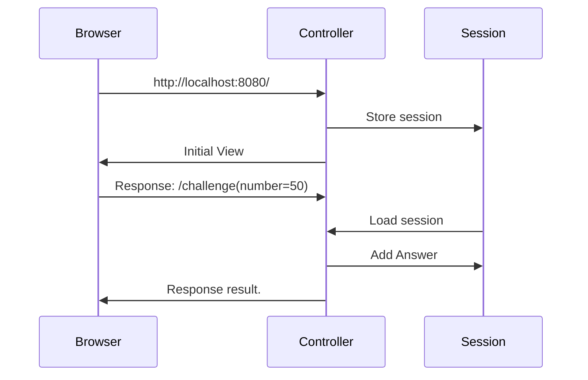

## Overview

セッション操作

* ゲーム開始時、サーバーは1~100の中から数字を一つ選び、それを「正解」とする。
* ユーザーは(1)の正解を推測し、その数字を「回答」として入力する。
* コンピューターは「正解」と「回答」を比較し、以下のようなメッセージを表示する。
* 正解 < 回答の場合：「もっと小さいです」と表示する。
* 正解 = 回答の場合：「正解です！」と表示する。
* 正解 > 回答の場合：「もっと大きいです」と表示する。

### 実行例

ブラウザから http://localhost:8080/ へアクセスすると、ゲーム開始となる。

### シーケンス図

